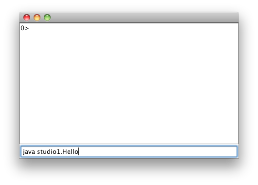

Read this before starting:

##Studio Sessions Overview:

* We gather as a community in studio session to learn from each other.
Our community includes:
  * Instructor
  * TAs
  * Students

* Our community is egalitarian in terms of learning:
all of us will have questions and all of us should try to provide answers.
* The idea is to challenge each other and to share what we discover.
* You are free (downright encouraged) to collaborate in this session:
  * Primarily within your small group of 2-4 people
  * Secondarily with any group in the class
  * As much as you like with the instructor and TAs
* In studio, the instructor's mission is to observe, interact, and work with groups.
  * How you think, work, and arrive at a solution is more important than getting the right answer.
  Thus, the instructor and TAs will observe you throughout the exercise and offer constructive feedback.
  * The help you receive may be incomplete at any given time,
  so that you can work through more of the solution on your own.
  Do not hesitate to ask for more help.
* In studio, the student's mission is to acquire new knowledge and skills by
the collaborative solving of problems.
  * You are **not** graded on whether you get wrong or right answers on this exercise.
  * You are graded on your level of participation in studio.
* Participation is defined as:
  * Asking questions, at any level, of any person in the studio
  * Discussing possible solutions with people in the studio
  * Helping somebody in the studio solve a problem
  * Presenting or demonstrating your solution to people in the studio
  * Documenting your group's experiences in studio
* Please eliminate external stimuli (cell phones, IM, Facebook) during studio.
Please devote yourself to learning, mastering, and extending the material for the session.

  > The results of your studio session are to be reported and documented in a file that you save in your workspace.
  > You are to commit that report prior to leaving studio.
  > In the descriptions of the studio exercises,
  > verbs like *report* and *document* are indications of activities you should summarize and discuss in your report.
  >
  > In your groups, take turns documenting results,
  > looking over shoulders, and staffing the keyboard.
  >
  > It is unacceptable to copy anything without understanding it.
  > At any point, the TA or instructor can point to something you've done and ask you why it works,
  > or change it and ask what would happen with the modification.

  > * To receive credit for a studio, your team must
  > cleared by a TA using the green box at the bottom of this page.
  > * Be careful how you use the web.  You are required to develop solutions
  as a group by thinking not by finding solutions that have been thought
  out by others.  You must be able to explain anything that you have done.

### Warmup

* First, form a group:
  * If you are at a table with a large, wall-mounted screens, a group of 3-4 people is fine.
  * If you are seated at a table without a large screen, a group of 2 people is better.
* All but one member of your group should have this web page open so you can follow along and see the instructions as you work.
* All members of the group should update their repositories:
  * Open your repository in eclipse
  * Right-click (control-click on a mac) on your repository name
  * Drag down to `Team...``
  * Choose `Update`
  * Supply your WUSTL key and password as necessary
* Plan to have one computer at which your team does its work. Initially, one of you will be in charge of typing at that computer.
* Throughout the studio, you should trade who is in charge of the keyboard.
Before doing so, **commit your work** to make sure your work is saved.

###Procedure

* You will complete a series of simple Java programs, and run each program
to ensure it performs its task correctly.
* The files for this program are in the `studio1` package of the repository you loaded.
* There are two ways to run programs in this course:
  * **Directly in eclipse:** To run a program, right- (control-)
  click on the file's name, choose `Run As &hellip; Java Application`.  The program will then
  launch and prompt you for the inputs it needs. Try this now on the `Hello` class.  When it asks you how you are feeling, enter whatever comes to mind.

    The tools we use are replete with buttons and menus to make programming
    easier.   One such button near the top of your eclipse window is a green
    circle containing a white triangle: 

    Clicking on this button will run the program again. Try running the program using the button.  Isn't that more fun?

  * **Command line:** This method simulates how you would run your
  program from *outside* eclipse.  You should see a `usecommandline.jar`
  file in your studio repo.  Double-click it to run the program, and
  a window should appear.
  If you click in the lower part of that window, you can type commands into that window, including a command that will run
  your Java program.

  For example, to run the `Hello` example, included in this studio,
  you would type:

  `java studio1.Hello`

  

  and hit enter. **Try that.**

  On the command line, you can supply the program's inputs directly, instead
  of being prompted for them one at a time.

  In the command line window, type:

  `java studio1.Hello spunky`

  and hit return. Notice that the program now uses `spunky` as its input.

**Some of the following exercises are adapted from Princeton University's
<ahref="http://www.cs.princeton.edu/courses/archive/spring12/cos126/precepts.php">COS&nbsp;126 course</a>, based on our text by Sedgewick and Wayne.**

For each of the following exercises, find the file in your studio repository
and complete it to do the assigned task.

`HiOne`
  1. Say hello to the name supplied as input to this program.
    > Sample output: `Hi Ron.  How are you?` (assuming `Ron` was supplied
    as input)

    > Feel free to end the output with punctuation that indicates the level
    > of enthusiasm associated with your greeting.

`HiFour`
  1. Expand your hospitality to the *four* names supplied to this program.
    > Sample output: `Greetings Cormen, Leiserson, Rivest, and Stein.`
    > **Be sure to put in** <ahref="http://en.wikipedia.org/wiki/Serial_comma">proper punctuation</a>
    > **to separate the names.**

`Ordered`
  1. Define a `boolean` variable `isOrdered` whose value is
  `true` if the three values are either in strictly ascending
  order (`x&nbsp;&lt;&nbsp;y&nbsp;&lt;&nbsp;z`) or in strictly descending order
  (`x&nbsp;&gt;&nbsp;y&nbsp;&gt;&nbsp;z`), and `false` otherwise. Print out the variable
  `isOrdered` using `System.out.println(isOrdered)`.

    > Some of you may already know some Java.  We have not yet covered the
    > `if` statement.  You must use what has been taught so far (simple
    > expressions and assignment) to accomplish this task.

`Average`
  1. Complete this code so that it prints the average of its two integer inputs.

    > Sample output:
    > `Average of 5 and 6 is 5.5`
    >
    > Note that the output is specified as a `double`,
    > because the average of two integers is not necessarily an integer.

OK, for this one, you are on your own.  We are not giving you code for this, but will instruct you how to create your own Java file from scratch:

  1. Right- (control-) click on the `studio1` package, select
  `New&hellip;Class`.

  2. Type the name `Average` and check the box that indicates
  you want to create `public static void main(String[] args)`:

  ![Class create] (newclass.png "New Class in Exlipse Example")

  3. Click `Finish` and your new class shows up in the editor window.
  4. At the top of the `main` method, you need to insert the
  `ArgsProcessor` code to accept two integers: `n1` and `n2`.

    > * Refer to other studio code to see how this is done.
    > * It is likely that when you type in the code, eclipse will flag your
    >   code with an error, because it doesn't know (yet) about `ArgsProcessor`.
    >
    >
    > Silly eclipse.
    >
    > You can get eclipse to solve its own problem by mousing over the error, and using the first suggestion that pops up, namely to include `ArgsProcessor` from
    > the `cse131` package.
    > Sometimes eclipse is *&uuml;ber* silly and won't tell you about that fix until
    > you have saved your file.  So save it.
    >
    > * Try to use meaningful messages to prompt for values.  The units for the values will be interpreted
    >   as *grams*.  For example, if `3` is specified for `carbs`,
    >   that means that this run of your program is for food that has 3 grams of
    >   carbohydrates.
    > A not so nice prompt:
    >
    > `int n1 = ap.nextInt("Yo, sup?");`
    >
    > and a nice prompt:
    > `int n1 = ap.nextInt("The first of two integers to be averaged?");`
    >
    > * Run your program and makes sure it prompts you correctly for its values.
    > * Ask a TA to check your work at this point.

  5. Finish the class so it prints out the appropriate message.

  

##Creative Exercise(s)

###Grading
  Here you write a program that computes your final score for this course,
  based on the grades you receive.  This program can be useful in tracking your possible final grades based on
  the grades you have already received and the expected grades for your future
  assignments.

* Review the
<a href="../../Info/grades.html">grading policy</a> for this semester.

* Arrange for your program to accept the student's name as well as one input for each value used in
computing your final grade according to the <a href="../../Info/grades.html">grading policy</a>.
Unless otherwise stated, the range of each of those values is from 0 to 100.
Below are examples of values used in past semesters.  Use ArgsProcessor to accept input and store
these values using variables with the appropriate data types:

  * The number of `participation` points you received
  * Your average `quiz` score
  * The number of `studio` points you received
  * The number of `lab` points you received
  * The number of `extension` points you received
  * Your score on `exam one`
  * Your score on `exam two`
  * Your score on `exam three`

* Calculate the weighted average of the above values, using weights as specified in the <a href="../../Info/grades.html">grading policy</a>.
The result of this computation should be a `double`.

* Since your grade is not rounded for this course, you should convert the `double` to an `int`.

  * This conversion can be accomplished by *casting*, a topic you should
  find in your text or in the lecture material.

* Determine if you received a plus or a minus attached to your grade, such as a "B+" or "A-".
Refer to the <a href="../../Info/grades.html">grading policy</a> for these cutoffs (they are the same
for each letter grade). Consider using the <a href="http://www.cafeaulait.org/course/week2/15.html">mod operator</a> `%` to compute the rightmost
digit of a grade (for example, finding the `8` in `98`.
Once you have that digit, devise a boolean expression for each of the following:

  * Does the rightmost digit warrant a `+` on the letter grade?
  * Does the rightmost digit warrant a `-` on the letter grade?

Given this input for a given semester's grading policy:

| name          |Jarett |
| ------------- | ----- |
| participation | 100   |
| quizzes       | 92    |
| studios       | 100   |
| labs          | 85    |
| extensions    | 90    |
| exam one      | 88    |
| exam two      | 94    |
| exam three    | 91    |

 
Your output might resemble:

    Jarett:
    Total score: 90.65
    Grade for this course: 90
    Final grade has a...
      Plus: false
      Minus: true

###Ice Cream

As a group, brainstorm the best data type to represent the following
situations:

  > Often, there is no *right* or *wrong* answer.  Be prepared
  > to defend your choices.

* The number of times you have been to <a href="http://www.teddrewes.com/home/default.aspx">Ted Drewes</a>
* Whether you like <a href="http://www.teddrewes.com/sitecontent/dynamiccontent.aspx?pid=76&uid=D18D6B6C-7948-4C04-8F59-12F77F9F3F49">vanilla frozen custard</a> or not
* The number of people you can take in your car
* The price of a small cup of <a href="http://www.teddrewes.com/sitecontent/dynamiccontent.aspx?pid=76&uid=D18D6B6C-7948-4C04-8F59-12F77F9F3F49">vanilla frozen custard</a>
* The name of your favorite <a href="http://www.teddrewes.com/sitecontent/Specials.aspx">special</a> offering from
<a href="http://www.teddrewes.com/home/default.aspx"> Ted Drewes</a>
* The <a href="http://www.teddrewes.com/sitecontent/dynamiccontent.aspx?pid=92&uid=1FA7B06F-39EC-4A8E-8A31-23EE0B783705">address </a>
of the <a href="http://www.teddrewes.com/home/default.aspx#">Ted Drewes </a> that is closest to campus
* The percentage of calories in <a href="http://www.teddrewes.com/sitecontent/dynamiccontent.aspx?pid=76&uid=D18D6B6C-7948-4C04-8F59-12F77F9F3F49">vanilla frozen custard</a> that come
from fat
* The probability that you will see a friend at <a href="http://www.teddrewes.com/home/default.aspx">Ted Drewes</a> when you go there

##Submitting your work (read carefully):
* If your studio contains a `feedback.txt` file, respond to the questions and supply any requested information.
* You must commit all of your work to your repository.
It's best to do this from the top-most level of your repository, which bears your name and student ID.
* Follow the instructions in the green box below to receive credit for your work.
